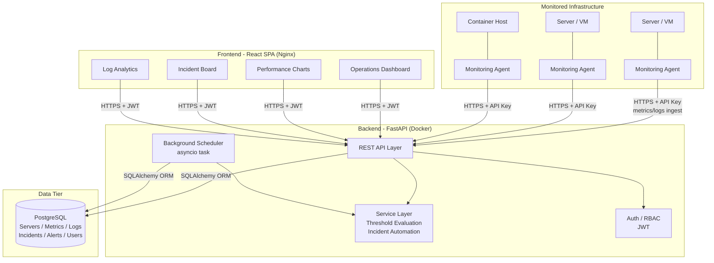
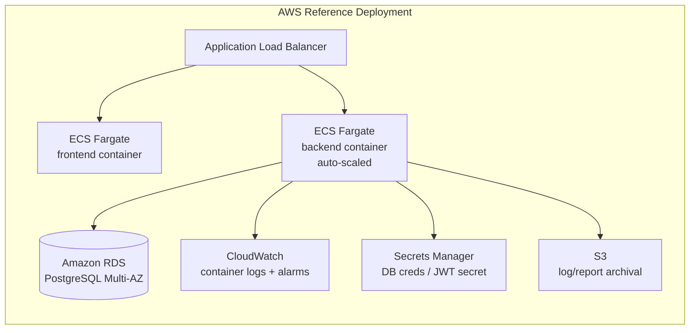

# System Architecture

## Overview

The platform follows a **layered, service-oriented architecture** with a clear
separation between data collection (agents), the API/business-logic tier, the
persistence tier, and the presentation tier. This mirrors how commercial AIOps
tools (Datadog, New Relic, Dynatrace) are structured at a high level, scaled
down to a portfolio-appropriate implementation.

## Component Responsibilities

| Component | Responsibility |
|---|---|
| **Monitoring Agent** (`monitoring-agent/agent.py`) | Runs on each monitored host. Collects CPU/memory/disk/network/process metrics via `psutil`, tails application log files, and ships both to the API on a fixed interval using an agent-scoped API key. |
| **API Layer** (`backend/app/api/routes/`) | FastAPI routers exposing versioned REST endpoints (`/api/v1/...`) for auth, servers, metrics, logs, incidents, alerts, and dashboard aggregates. Fully documented via OpenAPI/Swagger at `/api/docs`. |
| **Service Layer** (`backend/app/services/`) | Framework-agnostic business logic: threshold evaluation, alert generation, and the auto-incident-creation rules that give the platform its "AIOps" behavior. Decoupled from FastAPI so it's independently unit-testable. |
| **Background Scheduler** (`backend/app/services/scheduler.py`) | An `asyncio` loop started in the FastAPI lifespan hook that periodically sweeps for servers with missed heartbeats and marks them `OFFLINE`. |
| **Auth / RBAC** (`backend/app/core/security.py`, `deps.py`) | JWT-based authentication with bcrypt password hashing and role-based route guards (`ADMIN`, `SRE`, `OPERATOR`, `VIEWER`). |
| **PostgreSQL** | System of record for all servers, time-series metrics, logs, incidents, alerts, users, and audit trail. Modeled with SQLAlchemy 2.0 + versioned via Alembic migrations. |
| **React SPA** (`frontend/`) | Single-page operations dashboard: Overview, Performance, Incidents, Log Analytics, and Server management, built with React, React Router, Axios, and Recharts. |

## Cloud Deployment Topology (Reference)

While this repository runs fully via Docker Compose locally, the same
container images are designed to map directly onto managed cloud services:

The equivalent Azure mapping would be **Azure Front Door -> Container Apps ->
Azure Database for PostgreSQL -> Key Vault -> Log Analytics**.

## Design Decisions & Trade-offs

- **Monolith-first backend**: a single FastAPI service (rather than
  microservices) keeps the project reviewable end-to-end while still being
  internally modular (routes / services / models / schemas), which is the
  right trade-off at this scale and is a common, defensible real-world choice.
- **Synchronous threshold evaluation on ingest**: alerts and incidents are
  evaluated inline with each metric/log write for immediate feedback in the
  dashboard; a background scheduler handles time-based conditions (missed
  heartbeats) that can't be detected from a single event.
- **API-key auth for agents, JWT for users**: agents authenticate with a
  long-lived per-server key (rotation supported by re-registering), while
  human users get short-lived JWTs plus refresh tokens - a standard split
  between machine-to-machine and human authentication.
- **Idempotent auto-incident creation**: the service layer checks for an
  existing open incident of the same source/metric before creating a new one,
  preventing duplicate incident storms during sustained outages.
