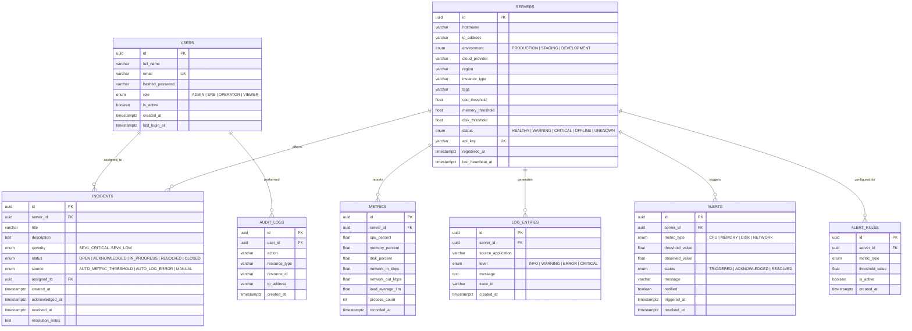

# Database ER Diagram

Canonical schema source: [`database/schema.sql`](../database/schema.sql)
(kept in sync with the Alembic migration in
`backend/alembic/versions/0001_initial_schema.py`).

## Indexing Strategy

| Table | Index | Purpose |
|---|---|---|
| `metrics` | `(server_id, recorded_at)` | Fast range scans for per-server performance charts over a time window. |
| `log_entries` | `(server_id, level, created_at)` | Supports the Log Analytics filters (server + severity + recency) in a single index scan. |
| `servers` | `hostname` | Fast lookup/search when the fleet grows. |
| `servers` | `api_key` (unique) | O(1) agent authentication on every ingest call. |
| `users` | `email` (unique) | Login lookups and duplicate-registration checks. |

## Growth Considerations

`metrics` and `log_entries` are the highest-volume tables. In a production
deployment beyond portfolio scale, this schema is designed to evolve into:

- **Partitioning `metrics`/`log_entries` by month** (native PostgreSQL
  declarative partitioning) once retention windows grow.
- **Migrating `metrics` to TimescaleDB or a dedicated TSDB** (Prometheus,
  InfluxDB) once ingest volume exceeds what a single Postgres instance
  comfortably handles, while keeping `servers`/`incidents`/`users` as
  relational data in Postgres.
- A rolling deletion job (`METRIC_RETENTION_DAYS` setting) to bound table
  growth for the current implementation.
